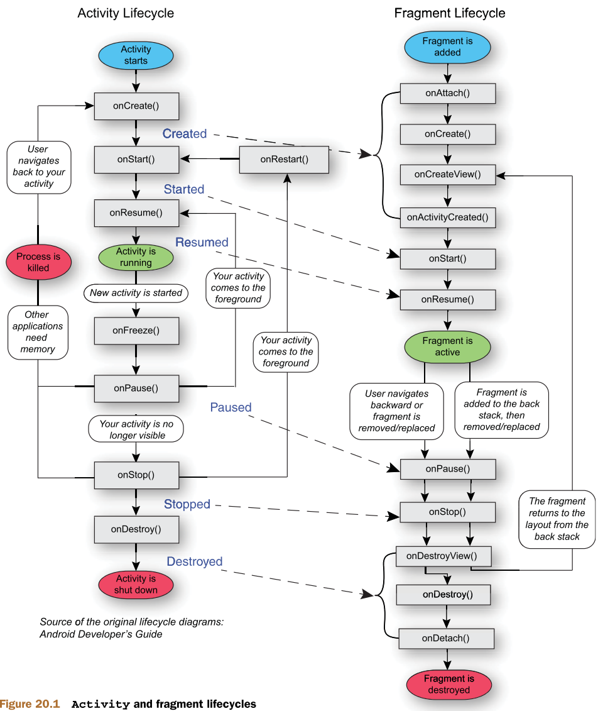

# Паттерн “Memento”

----
## Проблема:
При создании приложений на платформе Android используются контроллеры (в контексте MVC), которые при повороте экрана удаляются и заново создаются, при этом всё их внутреннее состояние (все параметры) теряется. Такие контроллеры называются **Activity** и **Fragment**. Причём **Activity** может «накладывать» на себя несколько **Fragment**-ов, так сказать управляет ими. Поэтому все объекты уровня View контролируются **Fragment**-ами. 

Но что делать, если состояние нужно сохранить между поворотами экрана, при этом заполняться это состояние должно только 1 раз?

Решить данную проблему поможет паттерн “Memento”!

## Описание приложения:
Рассмотрим конкретное приложение, на примере которого мы будем решать проблему, путём применения паттерна “Memento”.
> Вы можете установить приложение на Android устройство и ощутить всю проблему на себе.
> [Ссылка для скачиваения apk приложения до решения проблемы][appWithProblem]

При восстановлении состояния нельзя просто загрузить данные из уровня модели, т.к. некоторые важные данные для корректного отображения представлений  создаются динамически.

Приложение предназначено для записи на стирку в общежитиях ТГУ.   Приложение реализует следующий сценарий:


___

|Сценарий : ДобавитьНовуюЗапись|
|-----------------------------------------------------------|
|**Краткое описание:**|
|Пользователь хочет записаться на стирку на определённую дату|
|**Главные актёры:**                                    |
|Пользователь|
|**Второстепенные актёры:**|
|Нет|
|**Предусловия:**|
| 1. Пользователь генерируется при каждом запуске системы для примера|
| 2. Пользователь является зарегистрирован|
| 3. У пользователя нет текущей записи
| 4. У пользователя есть прошлые записи
| 5. Список доступных записей, при добавлении новой записи, генерируется случайно
| 6. При создании каждого экрана, все представления отображают стандартные значения, описанные выше |
|**Основной поток:**|
| 1. Пользователь авторизуется (просто нажать на кнопку «Log IN») и попадает на экран «Мои записи» 
| 2. Пользователь хочет добавить новую текущую запись, нажимая на кнопку  
| 3. Появляется список доступных пользователю записей на текущую дату
| 4. Пользователь может выбрать другую дату
| 5. Пользователь выбирает запись
| 6. Пользователь получает сообщение об удачном сохранении записи и перемещается на экран «Мои записи» 
|**Постусловия:**
|Нет
|**Альтернативные потоки:**
|Нет

*  Стоит пользователю перевернуть экран в момент, когда он выбирает дату для добавления новой записи, получая список доступных записей, то виджету "выбор даты" присваивается стандартное значение (текущая дата), а список доступных записей снова запрашивается у объектов уровня Model. 

* После того, как пользователь добавил новую запись, перешёл на экран «Мои записи», у него отображается добавленная запись в разделе «Текущая запись». Если перевернуть экран, то представления получают стандартное значения (у пользователя нет текущего заказа).

## Решение:

> [Вы можете скачать приложение с применённым решением][appWithOutProblem]

Согласно паттерну “Memento”, необходимо ввести в систему 3 обязанности: _Хозяин_ (Originator), _Хранитель_ (Memento), _Опекун_ (CareTaker).

### Распределение обязанностей:

С распределением обязанностей Хозяин и Хранитель проблем не возникло: 

_Хозяин_ – объект типа **Fragment**, состояние которого надо сохранять.

_Хранитель_ – необходимо ввести новый класс **Memento**, который будет иметь такую же структуру данных, что и **Fragment**.

Но кому назначить выполнение обязанности _Опекун_? 
Тут стоит воспользоваться паттерном распределения обязанностей, “Information Expert”, который гласит, что необходимо назначить обязанности тому классу, который имеет достаточно информации для выполнения обязанностей. 

**Activity** «накладывает» на себя **Fragment**, в свою очередь **Fragment** «накладывает» на себя представление. Это значит, что при перевороте экрана пересоздаётся экземпляр и **Activity** и **Fragment**. 

**Activity** и **Fragment** связаны между собой следующими отношениями:
___



Это означает, что как только началось создание объекта **Activity**, следом идёт создание объекта **Fragment**. Как только началось удаление объекта **Activity**, следом идёт удаление объекта **Fragment**. Следовательно, **Activity** точно знает, когда надо восстановить состояние фрагмента, а когда его сохранить. Поэтому, согласно шаблону “Information Expert“, обязанность Опекун должен выполнять класс **Activity**. 

В итоге получаем следующую структуру общения:
___

1. **Activity** запрашивает **Memento** у объекта **Fragment** в процессе выполнения переворота экрана, непосредственно перед уничтожением **Fragment**-а. 
2. **Fragment** создает и возвращает **Memento**, копируя в структуры данных **Memento** своё текущее состояние. **Activity** получает это состояние и сохраняет его, используя стандартный метод сохранения данных     ```(onSaveInstanceState(Bundle outState))```.


3. Позже, когда **Fragment** снова создаётся после переворота экрана, ему необходимо восстановить своё состояние. **Activity** возвращает **Memento** объекту **Fragment**.
4. Основываясь на информации, которая хранится в объекте **Memento**, **Fragment** изменяет свои внутренние структуры и переменные в состояние до момента удаления.


## Реализация:

Алгоритм наложения **Activity** на себя **Fragment**-а будет отличаться только типом накладываемого **Fragment**-а. Следовательно, чтобы вынести повторяющийся код, применим паттерн “Шаблонный метод”.

Инкапсулируем алгоритм в операцию  ```onCreate()``` абстрактного класса [SingleFragmentActivity][SingleFragmentActivity], и определяем примитивную операцию ```createFragment()```. 

Необходимо, чтобы **Fragment**-ы, состояние которых надо сохранить, подчинялись общему интерфейсу – [IsaveStateFragment][IsaveStateFragment], который состоит из 2 операций:


``` java 
public interface ISaveStateFragment {

    IMemento createMemento();

    void setMemento(IMemento state);

}
```
Это позволит реализовать 2 операции для получения и возвращения Хранителя на абстрактном уровне в [SingleFragmentActivity][SingleFragmentActivity] .


``` java 
public abstract class SingleFragmentActivity extends AppCompatActivity {

//Вызывается в начале создания Activity
public void restoreState(){

    if (this.state != null) {
        ((ISaveStateFragment) fragment).setMemento(this.state);
        this.state = null;
    }
}
```


``` java
//Вызывается в начале удаления Activity
public void saveState() {

    this.state = ((ISaveStateFragment) fragment).createMemento();

    }
}
```
## Структура:
### Стуктурное решение по сохранению **Fragment**-а [MakeOrderFragment][MakeOrderFragment]:

---
[Так же можете посмотреть общую структуру приложения, касаемой реализации паттерна "Memento"][allStruct]
---

## Результаты применения паттерна:

- [x] Поддержка сохранения между поворотами экрана проста и понятна, при этом заполняется это состояние только 1 раз.
- [x] Экономит время работы системы, особенно в случае загрузки большого кол-ва данных.
- [x] Сохраняется инкапсуляция состояния Fragment-ов.
- [x] Можно с лёгкостью выбирать какие именно фрагменты сохранять, реализуя в них интерфейс [IsaveStateFragment][IsaveStateFragment]
- [x] Простое и безболезненное расширение классов **Activity** 

## Дополнение:
- [Все классы проекта][allClasses]
- Классы, затронутые реализацией паттерна "Memento"
    * [SingleFragmentActivity][SingleFragmentActivity]
    * [MakeOrderActivity][MakeOrderActivity]
    * [ListOrderActivity][ListOrderActivity]
    * [ISaveStateFragment][ISaveStateFragment]
    * [ListOrderFragment][ListOrderFragment]
    * [MakeOrderFragment][MakeOrderFragment]
    * [IMemento][IMemento]
    * [ListOrderFragmentIMemento][ListOrderFragmentIMemento]
    * [MakeOrderFragmentIMemento][MakeOrderFragmentIMemento]
- [Приложение до применения решения][appWithProblem]
- [Приложение после применения решения][appWithOutProblem]
- [Вся структура применяемого решения][allStruct]


 [allClasses]: <https://github.com/evgenich95/CourseWork/tree/master/app/src/main/java/ru/coursework/coursework>
 [SingleFragmentActivity]: <https://github.com/evgenich95/CourseWork/blob/master/app/src/main/java/ru/coursework/coursework/UI/SingleFragmentActivity.java>
 [MakeOrderActivity]: <https://github.com/evgenich95/CourseWork/blob/master/app/src/main/java/ru/coursework/coursework/UI/MakeOrderActivity.java>
 [ListOrderActivity]: <https://github.com/evgenich95/CourseWork/blob/master/app/src/main/java/ru/coursework/coursework/UI/ListOrderActivity.java>
 [ISaveStateFragment]: <https://github.com/evgenich95/CourseWork/blob/master/app/src/main/java/ru/coursework/coursework/UI/fragment/ISaveStateFragment.java>
 [ListOrderFragment]: <https://github.com/evgenich95/CourseWork/blob/master/app/src/main/java/ru/coursework/coursework/UI/fragment/ListOrderFragment.java>
 [MakeOrderFragment]: <https://github.com/evgenich95/CourseWork/blob/master/app/src/main/java/ru/coursework/coursework/UI/fragment/MakeOrderFragment.java>
 [IMemento]: <https://github.com/evgenich95/CourseWork/blob/master/app/src/main/java/ru/coursework/coursework/entity/Memento/IMemento.java>
 [ListOrderFragmentIMemento]: <https://github.com/evgenich95/CourseWork/blob/master/app/src/main/java/ru/coursework/coursework/entity/Memento/ListOrderFragmentIMemento.java>
 [MakeOrderFragmentIMemento]: <https://github.com/evgenich95/CourseWork/blob/master/app/src/main/java/ru/coursework/coursework/entity/Memento/MakeOrderFragmentIMemento.java>
 [appWithProblem]: <https://drive.google.com/file/d/0B0KGha8XVO0LWWxkWDJjUmdqWHM/view?usp=sharing>
 [appWithOutProblem]: <https://drive.google.com/file/d/0B0KGha8XVO0LOGUwNzE5eU11a28/view?usp=sharing>
 [allStruct]: <https://github.com/evgenich95/CourseWork/blob/master/images/allStruct.png?raw=true>
 
